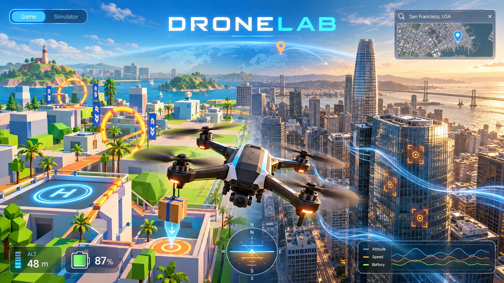
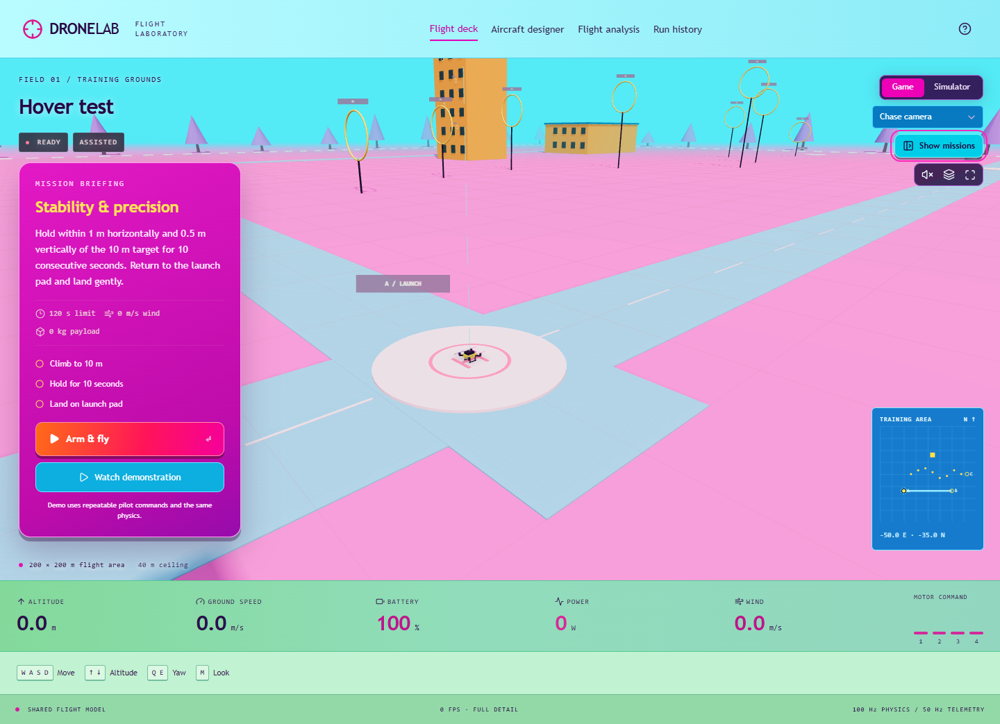
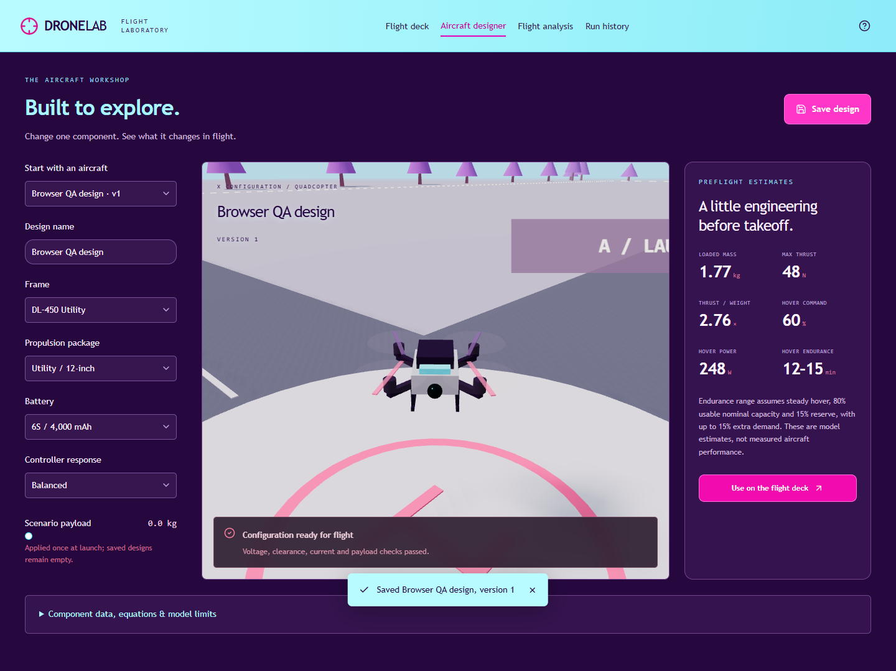
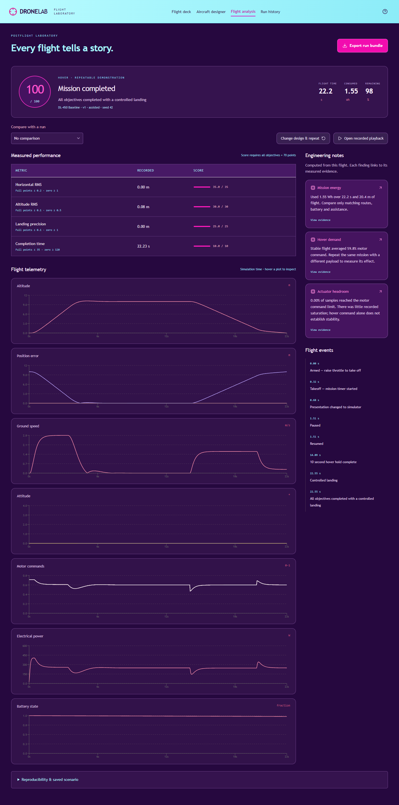
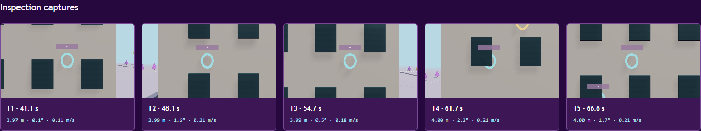
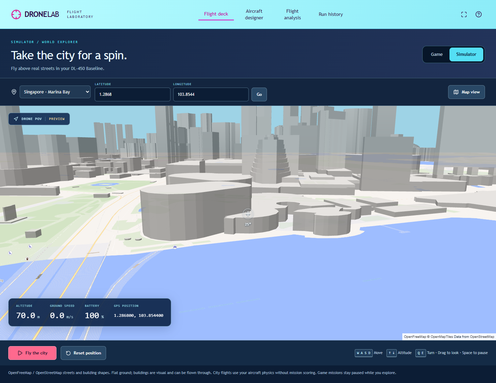
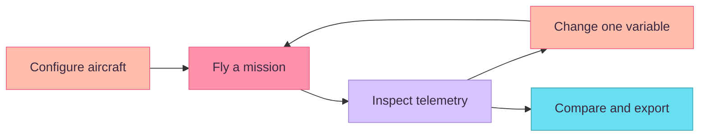

<div align="center">

# DRONELAB

### Build. Fly. Understand.

A playful browser flight laboratory with real simulation underneath.


<br /><br />



<sub>Cover artwork: the DroneLab vision. Actual application screenshots below.</sub>

**[Quick start](#quick-start) · [Take the tour](#take-the-tour) · [Five missions](#five-missions) · [Test results](VALIDATION.md)**

</div>

Choose an aircraft, fly a mission, and discover what changed. DroneLab connects a hands-on 3D flight experience to telemetry, engineering findings and repeatable experiments. This is the working training release built from the DroneLab v1.2 handover.

## Take the tour

<table>
<tr>
<td width="50%"><br /><strong>01 / Room to fly</strong><br />Hide the missions panel and the same flight view expands into its space. Bring it back whenever you need it.</td>
<td width="50%"><br /><strong>02 / Your aircraft, your experiment</strong><br />Change the frame, propulsion, battery or controller response. Check the estimates before takeoff.</td>
</tr>
<tr>
<td width="50%"><br /><strong>03 / Follow the evidence</strong><br />Explore seven linked plots, score breakdowns and event highlights. Compare runs and scrub recorded flight poses.</td>
<td width="50%"><br /><strong>04 / Keep what you discover</strong><br />Save designs and runs in your browser. Export complete ZIP bundles, including inspection images.</td>
</tr>
<tr>
<td colspan="2"><br /><strong>05 / Explore a real place</strong><br />Choose a city or enter coordinates, then fly your aircraft over mapped streets and buildings. This screenshot is from the running browser application.</td>
</tr>
</table>

> **Two places to fly.** Game has five scored missions in the colourful training grounds. Simulator opens a real geographic city, with first-person drone controls, live GPS and 3D building outlines. Your training flight pauses safely while you explore. The **Flight instruments** button keeps the engineering HUD available in Game.

## Five missions

|     | Mission             | Your objective                                                  | What it teaches                |
| :-: | ------------------- | --------------------------------------------------------------- | ------------------------------ |
|  ◎  | **Hover test**      | Hold at 10 m for 10 seconds, then land on pad A                 | Stability and precision        |
|  ◌  | **Obstacle course** | Clear eight ordered gates and reach the finish                  | Agility and clearance          |
|  ▣  | **Delivery**        | Carry 1 kg over 100 m, unload, return with at least 15% battery | Payload and energy             |
|  ▧  | **Inspection**      | Hold position, aim and capture five tower targets               | Camera control and observation |
|  ≋  | **Wind challenge**  | Hold through seeded wind and three gusts, recover and land      | Disturbance rejection          |

Every mission includes a **Watch demonstration** option. The repeatable pilot sends commands through the same physics and controller as the rest of the simulation; its runs are clearly marked as demonstrations.

## The experiment loop



| Built for flying                                | Built for understanding                          |
| ----------------------------------------------- | ------------------------------------------------ |
| Assisted and Attitude controls                  | 100 Hz rigid-body physics; 50 Hz telemetry       |
| Chase, FPV and ground cameras                   | Delayed motor response, drag, wind and energy    |
| Game missions and real city exploration                 | Seven synchronized plots and event intervals     |
| Keyboard, basic touch controls, gamepad mapping | Comparison warnings when conditions differ       |
| Hide/show mission panel; fullscreen view        | Recorded playback and versioned aircraft designs |
| Pause, resume and repeatable demos              | CSV + JSON + image export bundles                |

## Quick start

**Windows:** install **Node.js 22.13 or newer**, then double-click [`Launch-DroneLab.cmd`](Launch-DroneLab.cmd). Keep its terminal open and visit the URL it prints.

Or use PowerShell from this project folder:

```powershell
npm.cmd ci
npm.cmd run dev
```

Open **http://localhost:3000** (or the URL printed in the terminal). No API key or external account is needed for local simulation, storage or analysis. Use `npm.cmd` on Windows to avoid PowerShell wrapper restrictions.

**Your first flight:** choose **Hover test → Watch demonstration → 4× → Open flight debrief**. For manual flight, use **Arm & fly**, climb to 10 m, hold steady, then descend gently onto pad A. **Hide missions** is in the upper-right view controls.

<details>
<summary><strong>Keyboard and camera controls</strong></summary>

| Input                   | Action                                                         |
| ----------------------- | -------------------------------------------------------------- |
| **W / S**               | Forward / backward in aircraft heading                         |
| **A / D**               | Left / right                                                   |
| **↑ / ↓**               | Climb / descend in Assisted; collective adjustment in Attitude |
| **Q / E**               | Turn left / right                                              |
| **Enter**               | Arm a ready aircraft when the flight view is focused           |
| **Space**               | Pause / resume when the flight view is focused                 |
| **M**                   | Switch Game / city Simulator; configurable to V or B in Help            |
| **C**                   | Cycle cameras                                                  |
| **F**                   | Capture a valid inspection target                              |
| **Drag chase view**     | Orbit camera                                                   |
| **Drag FPV vertically** | Aim the inspection sensor                                      |

Release movement keys to hold position in Assisted mode. Flight pauses when the tab is hidden or after a long display interruption. Focused buttons retain normal Space / Enter activation.

Desktop keyboard is the primary tested input. Basic touch movement is included. Standard browser gamepads have stick-centre calibration and a configurable dead zone; physical gamepad validation remains outstanding.

</details>

<details>
<summary><strong>Production build and verification commands</strong></summary>

```powershell
npm.cmd run build
npm.cmd start
```

The compiled preview normally serves **http://localhost:8787**. This app needs an HTTP server; opening the source using `file://` will not run it.

```powershell
npm.cmd test              # numerical and mission acceptance tests
npm.cmd run examples     # regenerate success/failure bundles
npm.cmd run lint
npx.cmd tsc --noEmit
npm.cmd run test:browser  # requires a running server
```

Browser tests default to the development server and Microsoft Edge on Windows. To test the compiled preview:

```powershell
$env:DRONELAB_TEST_URL='http://127.0.0.1:8787'
npm.cmd run test:browser
```

Set `DRONELAB_BROWSER` to another installed Chromium executable if needed. Exact results, test coverage and environment limits are recorded in **[VALIDATION.md](VALIDATION.md)**.

</details>

## Explore the project

| Start here                      | What you will find                                                  |
| ------------------------------- | ------------------------------------------------------------------- |
| [Architecture](ARCHITECTURE.md) | Coordinates, physics, controls, mission rules and data contracts    |
| [Validation](VALIDATION.md)     | Measured results, browser checks and test limitations               |
| [Example runs](examples/)       | Five success bundles, five failure bundles and a payload experiment |
| [Simulation core](lib/sim.mjs)  | Framework-independent flight model and mission evaluators           |
| [Renderer](lib/scene.mjs)       | Three.js world, aircraft and cameras                                |
| [Browser app](app/page.jsx)     | Flight deck, designer, analysis and history                         |

<details>
<summary><strong>What is in an exported run?</strong></summary>

```text
dronelab-<mission>-<run>.zip
├── metadata.json       # aircraft, scenario, outcome and findings
├── telemetry.csv       # unit-labelled 50 Hz measurements
├── events.json         # mission events and presentation changes
├── inputs.json         # exact tick-indexed pilot input changes
├── captures.json       # inspection geometry and timing
└── inspection_images/  # rendered PNGs for browser inspection runs
```

Saved runs belong to the current **browser, device and origin**. Export before clearing browser data or moving between local and hosted versions. Storage failures are surfaced in the app. Node-generated inspection examples contain capture geometry; browser exports also contain rendered photographs.

</details>

## Model scope

**Included:** an authored training area, six degree of freedom quadcopter motion, quaternion orientation, four delayed bounded motors, seeded wind, approximate collisions, mission scoring and evidence-based engineering notes.

**City Simulator:** choose Singapore, San Francisco, New York or Tokyo, or enter latitude and longitude in separate fields to explore another mapped location. Click **Fly the city**, use the same movement keys, drag to look, and switch to **Map view** for orientation. Maps stream from [OpenFreeMap](https://openfreemap.org/) using [MapLibre](https://maplibre.org/). No API key is required; an internet connection and WebGL2 are needed. Attribution stays visible. If maps cannot load, retry or return to Game.

**Explore faster:** Simulator requests 12 m/s horizontal flight (previously 5), 5 m/s climb and 3.2 m/s descent; actual speed depends on aircraft dynamics. Game speeds are unchanged. Opening **Map view** pauses the flight so you can drag to pan and scroll or pinch to zoom. **Middle-click** a ground-map location to teleport, or select **Teleport → click/tap a destination → Jump here**. Jumps keep altitude, heading and battery while clearing momentum. **Undo jump** returns to the previous position; **Centre on drone** finds your aircraft after browsing. Jump destinations must remain within 5 km east/west and north/south of the starting location. Use the coordinate fields to start in another region. Return to **Drone view** and resume to continue flying.

City flight reuses the 100 Hz aircraft physics and battery model with position hold. It starts airborne, has a 500 m height / 5 km local exploration envelope and a 30-minute flight limit. It is separate from scored training runs and is not saved to mission history. Buildings are visual and can be flown through; ground is flat. This is real geographic vector data, not photographic Google Street View. **Deferred:** photographic imagery, surveyed city collisions and elevation, address search, multiplayer, hardware control and an external AI engineer.

Component curves are documented **synthetic approximations**. This project demonstrates internally tested model behaviour; it is not a validated real-aircraft digital twin. Simulation and analysis need no external map or AI service. Offline cold-start/installability is not claimed.

## Future implementation: photorealistic city flight

The goal is a freely flown drone camera over recognizable, realistically textured streets and buildings, like the Singapore and Tokyo photo references. The present OpenStreetMap vector buildings cannot produce that appearance by changing their gray paint alone.

1. **Improve the current map first.** Use mapped facade colors where available and material-based visual fallbacks elsewhere. Generic brick or glass patterns would improve the scene but must not be presented as photographs of those buildings.
2. **Pilot a textured 3D city.** Evaluate a licensed photorealistic 3D-tile provider in one covered area, with a compatible renderer, drone camera and altitude integration, performance measurements, and a fallback to the current vector map where detailed tiles are unavailable. [Google Photorealistic 3D Tiles](https://developers.google.com/maps/documentation/tile/3d-tiles-overview) are one candidate. [Street View panoramas](https://developers.google.com/maps/documentation/tile/streetview) are fixed photographic viewpoints, so they cannot alone provide continuous free flight.
3. **Control running costs before release.** A Google-based option requires an API key and billing-enabled project; its free usage cap and per-tile charges can change. Check [current pricing](https://developers.google.com/maps/billing-and-pricing/pricing), set conservative quotas, measure tile requests during real flights, and keep required attribution visible. The existing OpenFreeMap simulator remains the no-key option.

Photographic detail, usable 3D coverage, terrain accuracy, and building collisions would need separate validation. This is a roadmap, not a feature in the current release.

---

<div align="center">
<strong>One flight. One change. Something learned.</strong><br />
<sub>React · Three.js · Recharts · IndexedDB · Playwright</sub><br />
<sub>README presentation inspired by <a href="https://github.com/shun-ren/CAT-POKEDEX">CAT-POKEDEX</a>. The cover is supplied concept artwork; interface screenshots show DroneLab itself.</sub>
</div>
